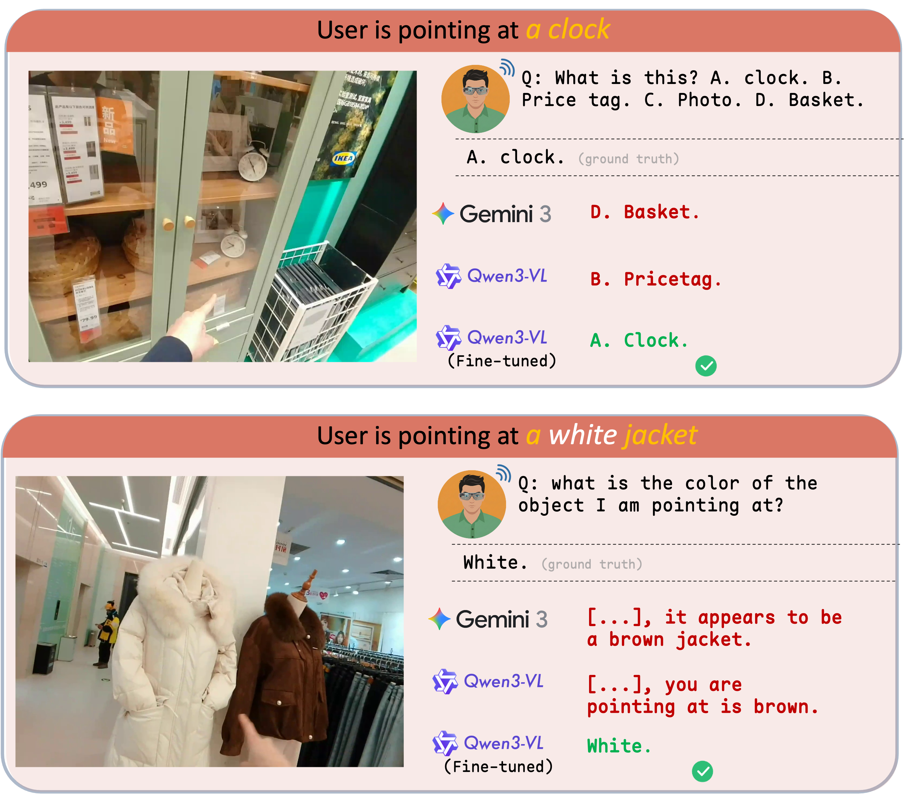
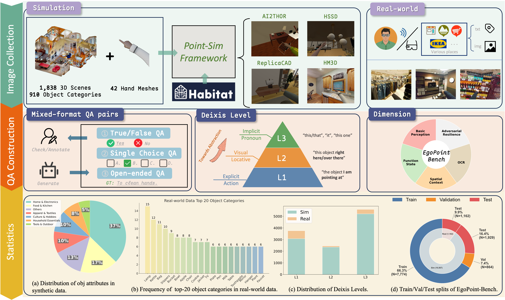
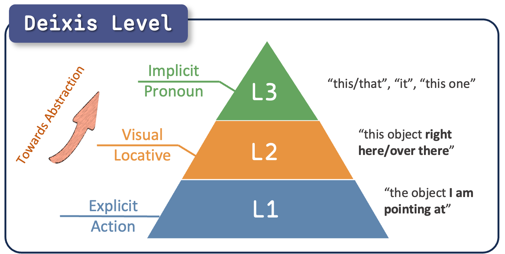
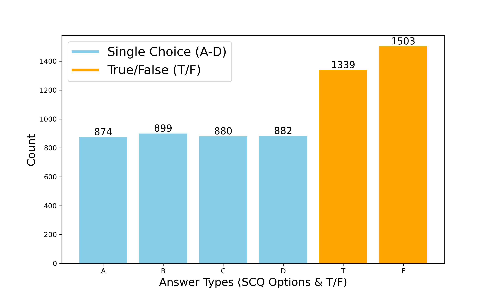

# EgoPoint-Bench: Benchmarking and Enhancing Referential Reasoning in Egocentric Vision

## 1. Introduction

EgoPoint-Bench is a comprehensive Question-Answering (QA) benchmark designed to evaluate and enhance multimodal pointing reasoning in egocentric views. Unlike existing datasets that rely on third-person views or explicit text descriptions, EgoPoint-Bench focuses on the spatial semantics of pointing, addressing the critical issue of **Referential Hallucination** in current Multimodal Large Language Models (MLLMs).

Our benchmark comprises **11,729 high-fidelity samples** (10,567 simulation and 1,162 real-world), bridging the gap between simulated physics-based supervision and real-world application.

## 2. Motivation: Referential Hallucination

Current state-of-the-art MLLMs often fail to precisely ground the spatial semantics of pointing. Instead of tracing the geometric projection of the pointing finger, models frequently fixate on:

- **Proximal distraction:** Objects immediately adjacent to the hand.
- **Object saliency:** Visually prominent entities regardless of the pointing ray.



We term this phenomenon **Referential Hallucination**.

## 3. Environment Setup

Recommended:
- Python 3.10
- CUDA-enabled GPU

### Option A (Recommended): `uv` (faster)

```bash
uv venv --python 3.10
source .venv/bin/activate
uv pip install -r requirements.txt
```

### Option B: `conda`

```bash
conda create -n egopoint python=3.10 -y
conda activate egopoint
pip install -r requirements.txt
```

## 4. Quick Start (Qwen3-VL-8B)

### Step 1: Download benchmark images

Due to file volume, images are **not** stored in this GitHub repo. Please download from Hugging Face and place files into:

- `realdata_benchmark/test_img/`
- `simdata_benchmark/test_img/`

### Step 2: Download base model

Download `Qwen3-VL-8B-Instruct` from Hugging Face.

### Step 3: Download LoRA weights

Download the corresponding EgoPoint LoRA weights from my Hugging Face repository.

### Step 4: Edit evaluation script paths

In both scripts below, update:

- `MODEL_PATH`
- `LORA_PATH`
- `IS_LORA` (set `True` for LoRA evaluation)

Scripts:

- `eval_code/eval_real_qwen3vl.py`
- `eval_code/eval_sim_qwen3vl.py`

### Step 5: Run evaluation

Evaluate on the real benchmark:

```bash
python eval_code/eval_real_qwen3vl.py
```

Evaluate on the simulation benchmark:

```bash
python eval_code/eval_sim_qwen3vl.py
```

## 5. Dataset Overview and Statistics

EgoPoint-Bench is constructed using a dual-source strategy: a scalable simulation pipeline (**Point-Sim**) and rigorous real-world collection.



### 5.1 Data Scale and Distribution

| Source | Subset | Train | Val | Test | Total | Avg. Q Len |
| --- | --- | --- | --- | --- | --- | --- |
| Sim | HM3D | 3,227 | 365 | 718 | 4,310 | 10.12 |
| Sim | HSSD | 1,964 | 214 | 605 | 2,783 | 8.68 |
| Sim | AI2-THOR | 1,982 | 220 | 606 | 2,808 | 10.22 |
| Sim | ReplicaCAD | 601 | 65 | - | 666 | 8.67 |
| Real | MLVision Capture | - | - | 1,162 | 1,162 | 11.02 |
| Total | - | 7,774 | 864 | 3,091 | 11,729 | 9.81 |

### 5.2 Capability Taxonomy (5 Dimensions)

1. **Basic Perception (BP):** Identifies fundamental attributes (category, color, texture) aligned with gestures.
2. **Function and State (FS):** Infers semantic properties (e.g., edibility, operability) and states.
3. **Spatial Context (SC):** Perceives egocentric spatial relationships and reachability.
4. **OCR:** Extracts textual information from pointed targets (brands, slogans).
5. **Adversarial Resilience (AR):** Evaluates reliability against counterfactuals and void references.

### 5.3 Hierarchical Deixis Levels

- **L1 (Explicit Action):** Explicitly describes the gesture (e.g., "the object I am pointing at").
- **L2 (Visual Locative):** Implies spatial proximity (e.g., "that thing over there").
- **L3 (Implicit Pronoun):** Relies purely on visual context (e.g., "this").



### 5.4 Question Types

- **Multiple Choice (SCQ):** For rigorous automated evaluation.
- **True/False (TF):** For rapid discriminative testing.
- **Open-Ended (OQ):** For natural human inquiry (generation-oriented evaluation).



## 6. Repository Structure

```text
.
├── train_lora_code/         # LoRA training YAMLs + train/val JSON
├── eval_code/               # evaluation scripts
├── realdata_benchmark/      # real benchmark JSON (images downloaded separately)
├── simdata_benchmark/       # sim benchmark JSON (images downloaded separately)
├── paper_img/
├── requirements.txt
└── README.md
```

## 7. LoRA Training (LLaMA-Factory)

Training configs are provided in `train_lora_code/` (for example `qwen3_vl_lora_sft.yaml`).

Before training, register your train/val dataset names in LLaMA-Factory `data/dataset_info.json`, then run:

```bash
llamafactory-cli train /absolute/path/to/EgoPoint/train_lora_code/qwen3_vl_lora_sft.yaml
```

## 8. Citation

If you use this repository, please cite the corresponding EgoPoint-Bench paper (citation entry will be added).
